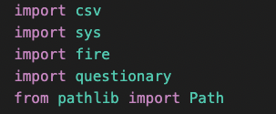
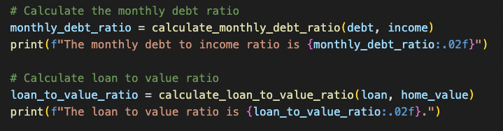
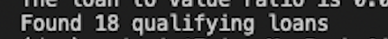

# **Loan Qualifier Application**
---

**This application allows a user to enter basic financial data and compare it to a user selected data file of bank loans.**

*With simple, easy to answer questions about debt, income, desired loan amount, and asset value, this application can filter for qualifing loans listed in the data file.* 
*The user then has the choice to save the qualifying loans to a csv file for future reference or sharing with others.*

*This application is used as a learning project in conjuction with the UC Berkeley FinTech Bootcamp.*

## **Technologies**
This project leverages Python 3.7 with the following packages:
 fire - for the commmand line interface and entry-point
 questionary - for interactive user prompts
 pathlib - for file creation and destination
 csv - for file creation and saving data
 sys - for exiting the project upon completion

## **Installation Guide**
Before running the application first install the following dependencies.

```pip install fire```

```pip install questionary```


**The following libraries should also be imported for proper execution of this program**





This program ```app.py``` is modulized into the following folders:

**The Main run function** 


**The Data File**


 data file of bank loans in csv format

**The Qualifiers File**


 - 2 folders filters and utils

The filters folder has  executable function files for filtering the bank loan data, while the utils contains functions for  calaculating debt to income ratio and loan to value ratio, as well as csv import

## **Usage**
To use use the loan qualifier application, clone the reposity and run the application

```python app.py```

Upon launching the app.py program you will be asked to enter the location of the csv file from which you want to pull bank loan criteria data. An example file called ```daily_rate_sheet.csv``` has been included within the data folder to use as an example of how the program runs.

The application with then prompt the user to enter financial data related to loan qualification.


The app.py runs the find_qualifying_loans function and uses the user entered data in calculation functions to determine the user's debt to income ratio, and loan to value ratio. These calculaiton funcions are located in the calculations.py file, nested in the qualifier folder. 



The results of these calculations are used in the filtering funcions which are located in the filters folder, nested in the qualifier folder.
   
    bank_data_filtered = filter_max_loan_size(loan, bank_data)
   
    bank_data_filtered = filter_credit_score(credit_score, bank_data_filtered)
    
    bank_data_filtered = filter_debt_to_income(monthly_debt_ratio, bank_data_filtered)
    
    bank_data_filtered = filter_loan_to_value(loan_to_value_ratio, bank_data_filtered)

The ```find_qualifying_loans``` function prints a statment to the user of how many loans from their data set they qualify for, and returns a list of qualifying loans.





Finally, the user is asked if they would like to save the qualifing loans list to a csv file with 'y/n' prompts, using questionary.  If/else conditionals are used with user prompts to either save the file to the user's generated file name, or to exit the application. 

```def save_qualifying_loans(qualifying_loans):
    if questionary.confirm("Would you like to save a your qualifying loans to a spreadsheet? (y/n)").ask():
        print ("Your qualifying loans list will be saved to a csv file saved as your last name and the date.")
        csv_file_name = questionary.text("Please type your last name, followed by the date, separated by a dash. Example: 'Smith-02-04-22'").ask()
        save_csv(qualifying_loans, csv_file_name)
        print(f"Your qualifying loans are listed in a cvs file called '{csv_file_name}'.csv")
    else:
        verify = questionary.text("To verify, please enter 'n' once again if you DO NOT wish to save your qualifying loans list.").ask()
        if verify == "n":
            print("Thank you for using the bank loan qualifier app. This app will now exit.")
            sys.exit()
        else:
            save_qualifying_loans(qualifying_loans)
```  

## **Contributors**
This code was written collabratively by UC Berkeley FinTech staff and given some added functionality by myself, Jodi Artman.  artman.jodi@gmail.com

##License
This project is licensed under the terms of the UC Berkeley license.
